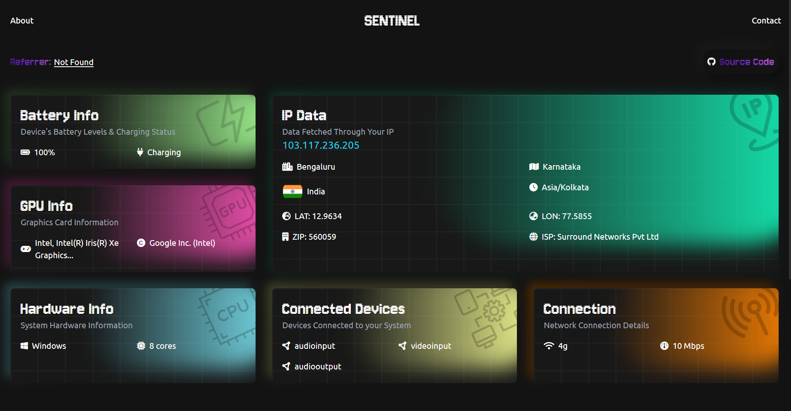

# Sentinel
> Your Digital Guardian

## Find out what they can see...

We open hundreds of websites everyday. Ever wondered how much data these websites can legally/ethically access about you and your devices from your browser?
Well, that is where Sentinel comes in! Sentinel uses vanilla JavaScript and some Web APIs to dig as much as ethically possible about the user from their device.

### Disclaimer

This project is purely for educational purposes. The aim is to educate people about how much of their data is freely available to the websites they browse. The data fetched while users browse this website is not being stored anywhere, as soon as the users exit the website, the data is cleared.
